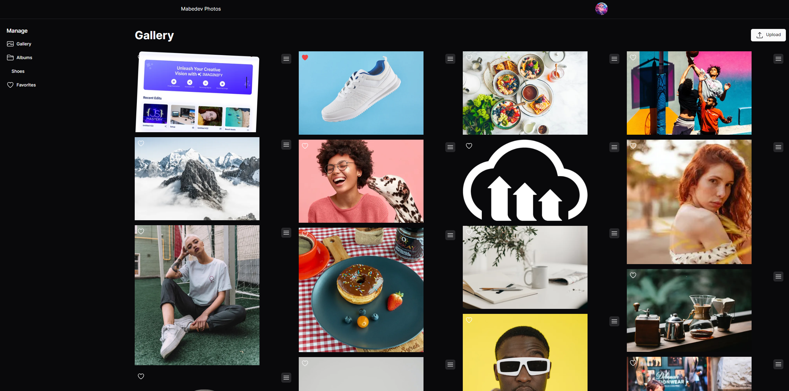

# <div align="center">Shadcn Cloudinary Image Gallery</div>


## About the Project

A sleek and modern image gallery built with Shadcn for elegant UI and Cloudinary for seamless image management. Features responsive design, efficient upload functionality, and dynamic image handling.

## Features

- 🌐 **Single Page Application**: Seamless navigation and fast load times.
- 🎨 **Custom Tailwind CSS Styling**: Fully responsive and customizable design.
- 🧩 **Shadcn UI Components**: Beautifully designed UI components for enhanced user experience.
- 🚀 **Netlify Deployment**: Fast, secure, and reliable hosting with continuous deployment.

## Tech Stack

<div align="center">
  


</div>

## Project Structure
```bash
├───app
│   ├───albums
│   │   └───[albumName]
│   ├───edit
│   ├───favourites
│   └───gallery
├───components
│   ├───icons
│   └───ui
├───lib
└───public
```

## Installation

To run this project locally, follow these steps:

1. **Clone the repository**
   ```bash
   git clone https://github.com/mabedd/Next-ShadcnUI-Gallery.git

2. **Navigate to the project directory**
   ```bash
   cd Next-ShadcnUI-Gallery

3. **Install Dependencies**
   ```bash
   npm install

4. **Start the App**
   ```bash
   npm run dev

<div align="center">
  <p>Made with ❤️ by Mohammed</p>
</div>
